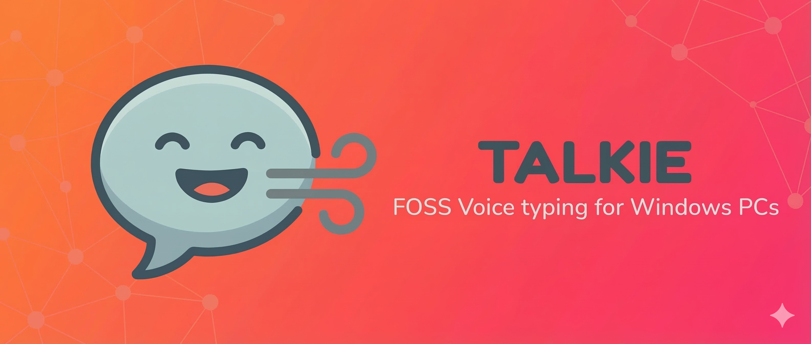

<p align="center">
  
</p>

# Talkie

[](https://sladge.net)

Talkie is a local, Windows-based dictation utility designed to be a lightweight clone of "Wispr Flow". It provides a "Hold-to-Talk" experience with context-aware text processing, allowing you to dictate naturally into any application.

## Features

- **Hold-to-Talk Interaction**: Global hotkey (default: `ctrl+win`) allows for instant dictation.
- **Near-Cursor Visual Feedback**: Anti-aliased floating indicator near your cursor shows recording (red with glow), processing (pulsing blue), and success (fading green checkmark) — rendered via Win32 layered window.
- **Context Awareness**: Automatically captures surrounding text to ensure perfect capitalization and spacing.
- **Multi-Provider Support**: Supports OpenAI (Whisper), Groq (Whisper-v3), and Anthropic (Claude) for STT and LLM processing.
- **Model Selection**: Choose STT and LLM models directly from Settings — no config file editing needed.
- **Per-App Profiles**: Configure different system prompts, snippets, vocabulary, and temperature per application — Talkie automatically applies the matching profile based on the focused window.
- **Built-in Profile Templates**: 6 ready-made templates for Email, Chat, Code/Terminal, Documents, Notes, and Browser — each with a tailored system prompt, default snippets, vocabulary, and pre-filled process names. Add templates from Settings with one click, then customize as needed.
- **Custom Snippets**: Define short abbreviations that expand into full text via a structured editor (e.g., `br` -> `Best regards`).
- **Custom Vocabulary**: Ensure specific names, brands, or technical terms are always spelled correctly.
- **Audio Feedback**: Soft pop sounds for recording start/stop — quick 30ms taps instead of harsh beeps.
- **First-Run Onboarding**: Auto-opens Settings with a Quick Start guide and progress badges when API keys are missing.
- **Modern Settings UI**: Dark-themed web interface (Bottle web server + browser) with sidebar navigation — Providers, API Keys, Hotkey, Snippets, Vocabulary, Profiles, and About sections.
- **Secure Key Storage**: API keys stored in Windows Credential Manager, never in config files.
- **Error Notifications**: Windows toast notifications for pipeline errors and discarded recordings.
- **Single Instance**: Only one copy can run at a time — prevents duplicate hotkey hooks.
- **Portable Executable**: Run as a single `.exe` with no installation or admin rights required.

## Getting Started

### Download & Run

Download `Talkie.exe` from the latest [Release](https://github.com/bloknayrb/talkie/releases) and run it. A walkie-talkie icon will appear in your system tray.

### Configure API Keys

On first launch, Talkie will automatically open the Settings window showing the Quick Start guide. Enter your API keys and save them — keys are stored securely in Windows Credential Manager.

You can also right-click the tray icon and select **Settings** at any time, or set keys via environment variables (`OPENAI_API_KEY`, `GROQ_API_KEY`, `ANTHROPIC_API_KEY`) or a `.env` file.

### Start Dictating

1. Focus on any text field (Notepad, browser, Slack, etc.)
2. Hold your global hotkey (default: `ctrl+win`)
3. Speak clearly
4. Release the hotkey — Talkie processes your audio and injects the text at your cursor

## Build from Source

### Quick (uses your existing Python)

```bash
git clone https://github.com/bloknayrb/talkie.git
cd talkie
pip install -r requirements.txt
python build.py
```

The executable will be in `dist/Talkie.exe`.

### Recommended (clean venv — smallest exe)

Using a virtual environment ensures only Talkie's dependencies are bundled, producing a much smaller executable (~40MB vs 200MB+).

```bash
git clone https://github.com/bloknayrb/talkie.git
cd talkie
python -m venv .venv
.venv\Scripts\activate
pip install -r requirements.txt
python build.py
```

### Run from source (no build)

```bash
pip install -r requirements.txt
python main.py
```

## Running Tests

```bash
pip install pytest
python -m pytest tests/ -v
```

## Project Structure

```
main.py                          # App entry point, tray icon, pipeline orchestration
build.py                         # PyInstaller build script
talkie_modules/
    paths.py                     # Single source for all path resolution
    logger.py                    # Structured logging with key-redacting filter
    config_manager.py            # Config loading/saving with keyring integration
    state.py                     # Thread-safe state machine (IDLE/RECORDING/PROCESSING/ERROR)
    exceptions.py                # Custom exception hierarchy
    api_client.py                # STT and LLM API calls via official SDKs
    audio_io.py                  # Mic recording and soft pop/tap generation
    context_capture.py           # Captures surrounding text via Windows UI Automation
    profile_matcher.py           # Resolves and applies per-app profiles at dictation time
    profile_templates.py         # Built-in profile templates (Email, Chat, Code, etc.)
    hotkey_manager.py            # Global key hold/release listener
    text_injector.py             # Pastes processed text via clipboard
    settings_server.py           # Bottle REST API for settings web UI
    status_indicator_native.py   # Win32 native layered window indicator
    icon_generator.py            # PIL-generated walkie-talkie icon
    notifications.py             # Windows toast notifications and error chimes
    web_ui/
        settings.html            # Settings SPA (single-page app)
        settings.css             # Dark theme styles
        settings.js              # Client-side logic
assets/
    talkie.ico                   # Multi-resolution app icon (16/32/48/64px)
    start.wav                    # Recording start pop (auto-generated)
    stop.wav                     # Recording stop double-tap (auto-generated)
tests/
    test_state.py                # State machine transitions and thread safety
    test_config_manager.py       # Config merging and API key validation
    test_api_client.py           # Mocked STT/LLM API calls
    test_audio_io.py             # Pop/tap generation and asset versioning
    test_text_injector.py        # Focus restoration and text injection
    test_context_stripping.py    # Prior-injection removal from context
    test_settings_server.py      # Settings API key masking and routes
    test_profile_templates.py    # Template definitions and apply logic
```

## License

This project is licensed under the MIT License.
